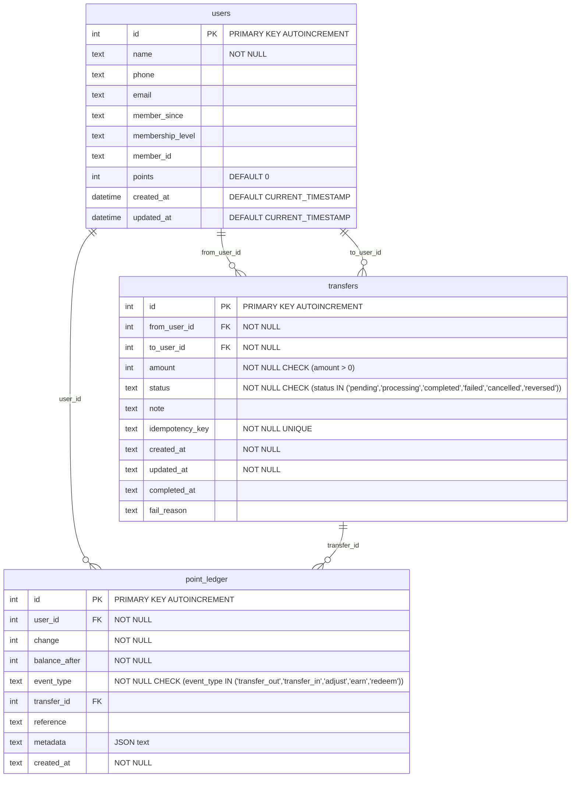

# Database Schema - ER Diagram

This document describes the database schema for the LBK Points Transfer System.

## Entity Relationship Diagram



## Table Descriptions

### users

The main user table storing member information and current point balance.

**Key Fields:**

- `id`: Primary key, auto-increment
- `name`: User's full name (Thai format)
- `member_id`: Unique membership identifier (e.g., LBK001234)
- `membership_level`: Gold, Silver, Bronze, etc.
- `points`: Current point balance (denormalized for quick access)

### transfers

Records all transfer transactions between users.

**Key Fields:**

- `id`: Internal transfer ID (auto-increment)
- `from_user_id`: Sender's user ID
- `to_user_id`: Recipient's user ID
- `amount`: Transfer amount in points
- `status`: Transfer status (pending, completed, failed, etc.)
- `idempotency_key`: UUID for external API identification
- `note`: Optional transfer description

**Status Values:**

- `pending`: Transfer created but not processed
- `processing`: Transfer in progress
- `completed`: Transfer successful
- `failed`: Transfer failed
- `cancelled`: Transfer cancelled
- `reversed`: Transfer reversed/refunded

### point_ledger

Append-only audit log for all point balance changes.

**Key Fields:**

- `user_id`: User whose balance changed
- `change`: Point change amount (+/-)
- `balance_after`: User's balance after this transaction
- `event_type`: Type of balance change
- `transfer_id`: Reference to transfer (if applicable)
- `metadata`: JSON field for additional data

**Event Types:**

- `transfer_out`: Points transferred to another user
- `transfer_in`: Points received from another user
- `adjust`: Manual balance adjustment
- `earn`: Points earned from activities
- `redeem`: Points redeemed for rewards

## Indexes

### Transfer Indexes

```sql
CREATE INDEX idx_transfers_from ON transfers(from_user_id);
CREATE INDEX idx_transfers_to ON transfers(to_user_id);
CREATE INDEX idx_transfers_created ON transfers(created_at);
```

### Point Ledger Indexes

```sql
CREATE INDEX idx_ledger_user ON point_ledger(user_id);
CREATE INDEX idx_ledger_transfer ON point_ledger(transfer_id);
CREATE INDEX idx_ledger_created ON point_ledger(created_at);
```

## Relationships

1. **users ↔ transfers**: One user can have many transfers (as sender or recipient)
2. **users ↔ point_ledger**: One user can have many ledger entries
3. **transfers ↔ point_ledger**: One transfer can create multiple ledger entries (debit + credit)

## Design Principles

### 1. Atomic Transactions

Each transfer operation creates:

- 1 record in `transfers` table
- 2 records in `point_ledger` table (sender debit + recipient credit)

### 2. Idempotency

- External API uses `idempotency_key` (UUID) for transfer identification
- Internal system uses auto-increment `id` for foreign key relationships

### 3. Audit Trail

- `point_ledger` provides complete history of all balance changes
- Append-only design ensures data integrity
- `balance_after` field enables point-in-time balance queries

### 4. Data Consistency

- `users.points` field is denormalized for performance
- Updated atomically with ledger entries
- Can be rebuilt from `point_ledger` if needed
